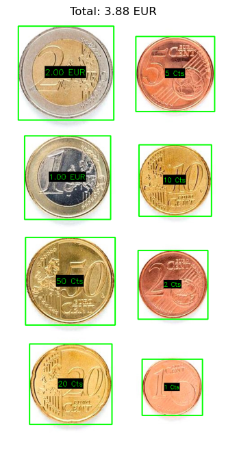
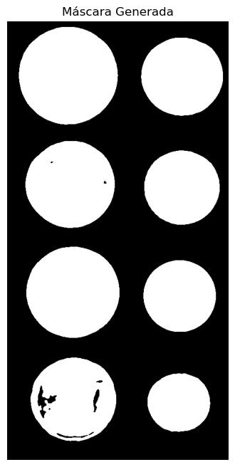
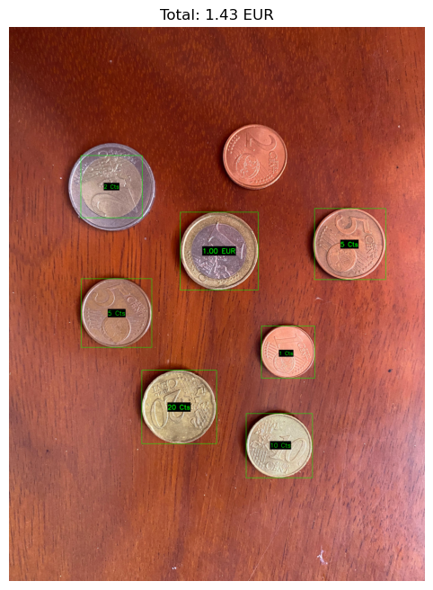
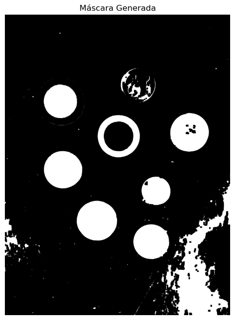
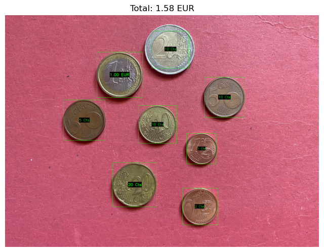
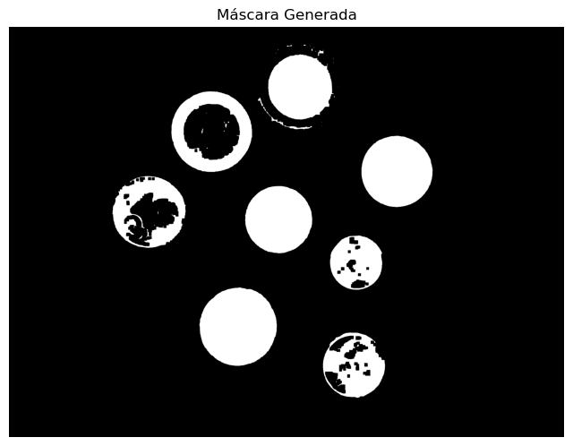
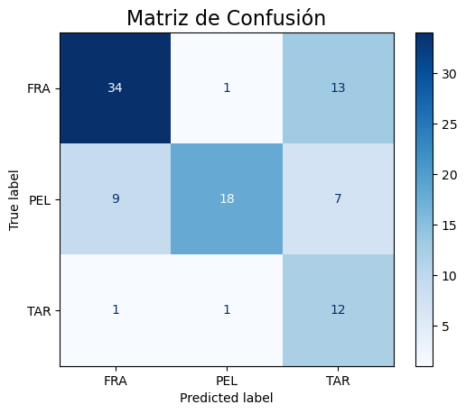

## Guion de prácticas de la asignatura Visión por Computador (VC)  
Modesto Castrillón Santana  
Universidad de Las Palmas de Gran Canaria  
Escuela de Ingeniería en Informática  
Grado de Ingeniería Informática  
Curso 2025/2026  

**Dunia Suárez Rodríguez**

<!-- - [Práctica 3](P2/README.md) -->

## Descripción
En la Práctica 3 se pretende adquirir nociones para extraer información geométrica de objetos presentes en una imagen, con el fin de caracterizarlos y posteriormente ser capaz de identificarlos de forma automática en categorías. 

## Requisitos
Para esta práctica haremos uso de Python 3.11, Anaconda y de las librerías:  
- OpenCV -> para el procesamiento de imágenes 
- NumPy  -> para el calculo numérico
- Matplotlib -> para crear gráficos
- pandas -> para leer y manejar datos estructurados, como un archivo
- sklearn -> para el maching learning

Además nos conectaremos al entorno 'VC_P1' creado con Anaconda.

## Resultados
La visualización de los resultados se obtiene al ejecutar el código. Desglosamos ahora cada ejercicio:  
El uso de la IA ChatGPT fue usado para: resolver dudas, aplicar funcionalidades y funciones de la librería que desconocía y guiarme.

### Ejercicio 1
Objetivo ->  identificar de forma interactiva (por ejemplo haciendo clic en la imagen) una moneda de un valor determinado en la imagen (por ejemplo de 1€). Tras obtener esa información y las dimensiones en milímetros de las distintas monedas, realiza una propuesta para estimar la cantidad de dinero en la imagen. Muestra la cuenta de monedas y dinero sobre la imagen. 

Primero definimos el archivo de la imagen de entrada y un diccionario, `DATOS_MONEDAS`, con la información de referencia del diámetro real y el valor de cada tipo de moneda. 
También definimos la función auxiliar "calibrar_escala". 
    - Es una función de callback que se activa con el método `cv2.setMouseCallback`. Cuando el usuario hace click en la imagen, esta función identifica el contorno más cercano a las coordenadas del click. Usa `cv2.minEnclosingCircle` que determina el diámetro en píxeles del objeto de referencia, luego se compara dicho valor con el diámetro real conocido de la moneda de 1 euro, se calcula y establece la relación de escala `pixels_per_mm`, que será usada para medir las demás monedas.

A continuación pasamos al análisis automático de fondo y segmentación, el cual lograremos mediante una heurística: se muestrean las esquinas de la imagen, se convierten al espacio de color HSV, y se calcula su saturación media para determinar si esta es baja o alta.
    - En el caso de que sea baja, se clasificará al fondo como "simple"(blanco, gris,...). Además usaremos el umbralizado de Otsu sobre la imagen en escala de grises con la función `cv2.threshold` con el flag `cv2.THRESH_OTSU`, que es ideal para imágenes de alto contraste(ya que determina automáticamente el umbral de binarizazción óptimo).
    - Si el caso dado es el contrario, saturación alta, usaremos segmentación por color HSV. Se aplica `cv2.inRange` para crear una máscara que aísla los píxeles dentro de un rango de color metálico. Posteriormente, `cv2.morphologyEx` realiza una operación de cierre morfológico para rellenar huecos y consolidar las formas de las monedas.

En la fase final haremos la detección, identificación y visualización de valores de monedas. Para ello empezaremos usando la función `cv2.findContours` que extrae los contornos de la máscara. Una vez hecha la calibración interactiva, se itera sobre cada contorno y para cada uno se aplican filtros de área y circularidad, para descartar ruido y formas no redondas.
Si un contorno pasa los filtros, se mide su diámetro en mm y se clasifica comparándolo con los valores del diccionario `DATOS_MONEDAS`, si se encuentra coincidencia, su valor se suma al total.

Finalmente se visualizan los resultados con `cv2.rectangle` y `cv2.putText` que dibujan un recuadro y añaden la etiqueta con el valor de la moneda respectivamente. El tamaño de la fuente se calcula de forma dinámica, basándose en el diámetro en píxeles de cada moneda, lo que asegura que las etiquetas sean legibles independientemente de la resolución de la imagen. Para mejorar aún más la legibilidad, se dibuja un fondo negro sólido detrás de cada etiqueta antes de escribir el texto. El valor total acumulado se muestra como título. Las imagenes con el valor total y la máscara se presentan utilizando matplotlib.pyplot.

Para comprobar he aplicado el código propuesto a 3 imágenes:
1. Caso ideal con fondo blanco y sin solapamiento

| &nbsp; | &nbsp; |
|:---:|:---:|
|  |  |

2. Caso no ideal 1

| &nbsp; | &nbsp; |
|:---:|:---:|
|   |  |

3. Caso no ideal 2

| &nbsp; | &nbsp; |
|:---:|:---:|
|   |  |

### Ejercicio 2
Objetivo -> extraer características (geométricas y/o visuales) de las tres imágenes completas de partida, y aprender patrones que permitan identificar las partículas en nuevas imágenes.

Primero definimos la función `get_features()` que lee las imagenes de FRA, TAR y PEL en escala de grises para detectar formas. Con `cv2.createCLAHE()` creamos un objeto CLAHE para mejorar el contraste de la imagen y que las partículas resalten sobre fondos con poca iluminación. Aplicamos también `cv2.GaussianBlur()` para suavizar la imagen y eliminar ruidos y `cv2.adaptiveThreshold()` para realizar un umbralizado adaptativo que calcula un umbral diferente para diferentes regiones de la imagen, y luego lo invierte para poner las partículas en blanco y el fondo en negro.
Luego creamos un pequeño kernel `np.ones` para usar con las operaciones morfológicas `cv2.morphologyEx` con los flags `MORPH_OPEN` y `MORPH_CLOSE` que eliminan pequeños puntos de ruido y rellenan pequeños agujeros en las partículas respectivamente.

A continuación pasamos a la detección y extracción de características de contornos. Para ello usamos el método `cv2.findContours()` con el flag `RETR_EXTERNAL` que obtiene los contornos exteriores. Una vez obtenidos, el programa itera sobre cada contorno para analizarlo. Primero, se aplica un filtro de área con `cv2.contourArea()` para descartar formas demasiado pequeñas, consideradas ruido. Para los contornos válidos, se extraen varias características geométricas clave: se calcula su perímetro con `cv2.arcLength()`, su circularidad (una métrica que define cuán redonda es la forma), su rectángulo delimitador con `cv2.boundingRect()`, y su centroide (centro geométrico), que se determina a partir de los momentos de imagen con `cv2.moments()`. Estas características se agrupan en un diccionario para cada partícula y se almacenan en una lista. Finalmente, la función devuelve esta lista completa, que servirá como entrada para el clasificador.

Seguimos con otra funcion para analizar las imagenes de entrenamiento y aprender sus características. Para ello calcularemos la circularidad media de las partículas FRA, PEL y TAR y almacenamos su circularidad media en un diccionario.

Para crear el clasificador crearemos otra función que diferenciará las partículas FRA y TAR según un umbral calculado con el punto medio entre sus circularidades medias. La clasificación se realizará de la siguiente manera: 
    - si es muy circular se clasifica commo PEL(son los más circulares)
    - si no es tan circular, se compara con el umbral calculado para diferenciar entre TAR y FAR

Para la ejecución y evaluación definimos el conjunto de imagenes de entrenamiento con la función que analiza las características de las imágenes, luego creamos el clasificador con los umbrales aprendidos y ejecutamos la funciión `get_features()` en la imagen de prueba "MPs_test.jpg" para detectar todas las partículas. También cargamos las etiquetas correctas y las coordenadas de las partículas desde el archivo CV para poder comparar el modelo con la función `pd.read_csv`.

Tras inicializar las listas de evaluación (y_true, y_pred) para guardar las etiquetas reales y predichas y cargar la imagen de test a color con `cv2.imread()`, se inicia un bucle para asociar las partículas detectadas con las anotaciones manuales del archivo CSV. Este bucle itera sobre cada anotación `annotations.iterrows()` y busca si el centroide de alguna partícula detectada cae dentro de su rectángulo delimitador. Si se encuentra una coincidencia, se utiliza el clasificador para predecir su clase y se guardan las etiquetas real y predicha.

A continuación, se visualizan los resultados. Se dibuja la matriz de confusión con `ConfusionMatrixDisplay` y se iprime una tabla con métricas para analizar las partículas.

#### Análisis de la matriz de confusión:

En la matriz obtenida podemos interpretar lo siguiente:
 - Partículas FRA:
    - TP(true positive): partículas FRA clasificadas como FRA -> 34
    - FP(false positive): partículas TAR o PEL clasificadas como FRA -> 9 PEL y 1 TAR
    - FN(false negative): partículas FRA clasificadas como TAR o PEL -> 1 PEL y 13 TAR
 
 - Partículas PEL:
    - TP(true positive): partículas PEL clasificadas como PEL -> 18
    - FP(false positive): partículas TAR o FRA clasificadas como PEL -> 1 TAR y 1 FRA
    - FN(false negative): partículas PEL clasificadas como TAR o FRA -> 7 TAR y 9 FRA

 - Partículas TAR:
    - TP(true positive): partículas TAR clasificadas como TAR -> 12
    - FP(false positive): partículas PEL o FRA clasificadas como TAR -> 7 PEL y 13 FRA
    - FN(false negative): partículas TAR clasificadas como PEL o FRA -> 1 PEL y 1 FRA

Observamos que el clasificador que hemos creado detecta muchas partículas bien, pero tiene un problema pues detecta muchos falsos negativos.

Para concluir analizaremos los resultados impresos:
--- Resumen de Resultados ---
Total de partículas evaluadas: 96
Accuracy (Exactitud) General: 0.67

--- Métricas por Tipo de Partícula ---

                 precision  recall  f1-score   support

         FRA       0.77      0.71      0.74        48
         PEL       0.90      0.53      0.67        34
         TAR       0.38      0.86      0.52        14

    accuracy                           0.67        96
    macro avg      0.68      0.70      0.64        96
    weighted avg   0.76      0.67      0.68        96

------------------------------------
 - **Precisión**: mide la calidad de las predicciones -> TP/(TP+FP)
    La precisión de las partículas FRA y PEL son buenas siendo la de PEL la mejor, sin embargo la precisión de TAR es bastante mala pues tiene muchos falsos positivos
 - **Recall**: mide la capacidad de detección(párticulas que realmente son de una clase) -> TP/(TP+FN)
    El recall de todas las partículas es relativamente bueno, salvo el de la PEL que es algo más bajo debido la gran cantidad de falsos negativos
 - **f1-score**: media armónica que penaliza valores extremos, para saber si el modelo es bueno en precisión y recall a la vez -> 2·((Precisión·Recall)/(Precisión·Recall))
    Esta media es alta en las partículas FRA y PEL, pero baja en las TAR por culpa de su precisión

 - **Accuracy**: rendimiento general del modelo -> total aciertos/total de muestras
 - **Macro avg**: promedio de las precisiones y recalls
 - **Weighted avg**: promedio entre las clases pero le da más importancia a las clases que tienen más muestras -> ((metrica0 · support0) + ...) / total de muestras
 

<!-- - [Práctica 4](P4/README.md) -->
<!-- - [Práctica 5](P5/README.md) -->
<!-- - [Práctica 6](P6/README.md) -->
<!-- - [Práctica 7](P7/README.md) -->
<!-- - [Trabajo](Trabajo/README.md) -->

***
Obra bajo licencia de Creative Commons Reconocimiento - No Comercial 4.0 Internacional
