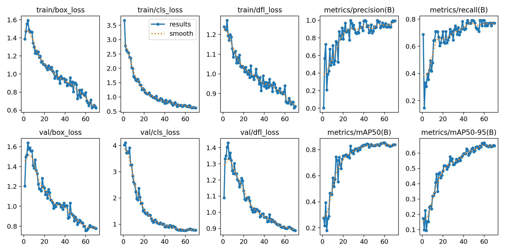
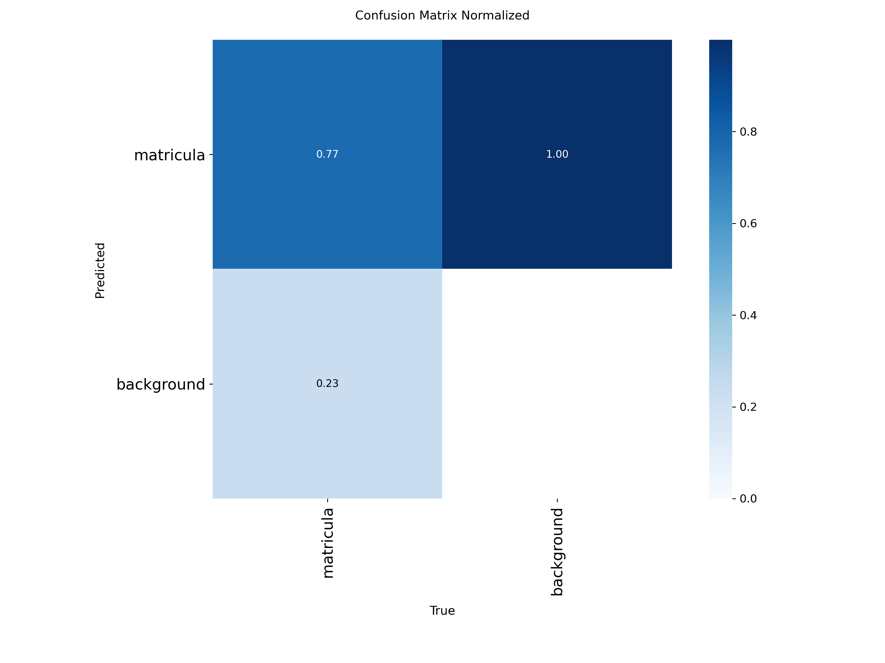
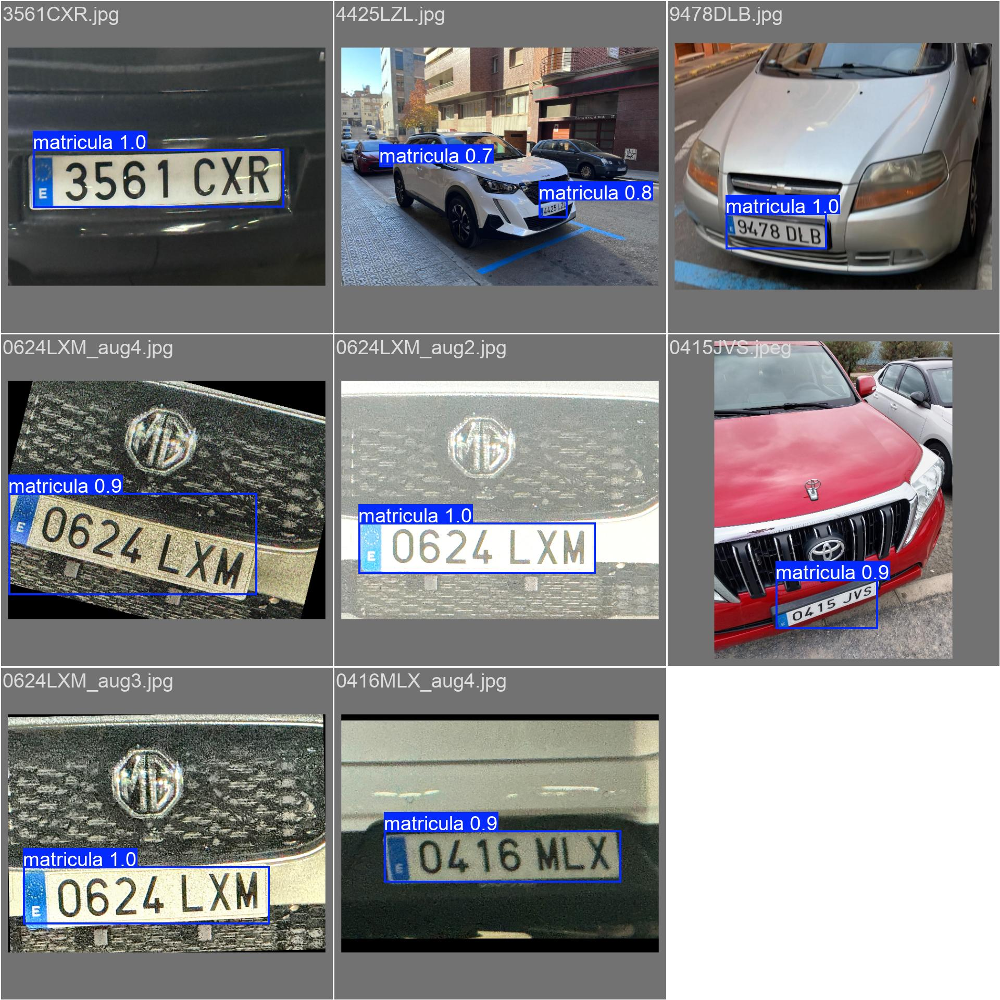
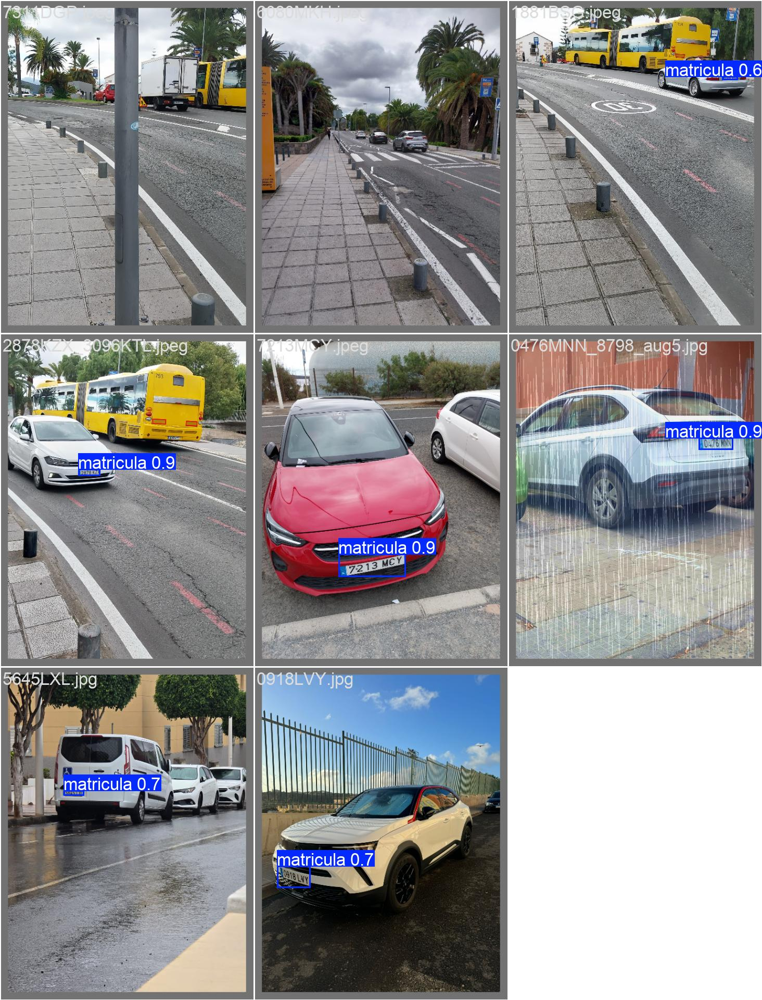

## Guion de prácticas de la asignatura Visión por Computador (VC)

Modesto Castrillón Santana  
Universidad de Las Palmas de Gran Canaria  
Escuela de Ingeniería en Informática  
Grado de Ingeniería Informática  
Curso 2025/2026 

** Dunia Suárez Rodríguez **

- # [Práctica 4 y 4b]
## Descripción
En la Práctica 4 se realiza detección, seguimiento e identificación por OCR de matrículas

## Requisitos
Para esta práctica haremos uso de Python 3.11, Anaconda y de las librerías:
- OpenCV
- NumPy
- Matplotlib
- YOLO
- glob
- time
- csv
- matplotlib
Además nos conectaremos al entorno 'VC_P4' creado con Anaconda.

## Modo de ejecución
1.  *Crear el entorno (basado en P4):*
    conda create --name VC_P4 python=3.9
    conda activate VC_P4
2.  *Instalar librerías principales:*
    pip install ultralytics
    pip install easyocr
    pip install pytesseract
3.  *Resolver Conflicto de OpenCV:*
    EasyOCR a menudo instala opencv-python-headless, rompiendo las funciones de visualización de OpenCV. Esta fue la solución aplicada:
    pip uninstall opencv-python-headless
    pip install opencv-python --upgrade
4.  *Instalar Tesseract-OCR:*
    Además de la librería de Python (pytesseract), se requiere el binario de Tesseract.

## Resultados
La visualización de los resultados se obtiene al ejecutar el código. Desglosamos ahora cada ejercicio:
La IA Gemini se utilizó como recurso de apoyo para aclarar dudas, explorar funcionalidades de la librerías que no conocía y obtener orientación.

### Entrenamiento modelo que detecte matrículas
Para el entrenamiento de nuestro modelo los parámetros más importantes especificados fueron:
* 70 épocas (número de veces que el modelo verá el dataset de entrenamiento completo) pues para la cantidad de imágenes que tenemos es una buena cantidad y evita overfitting o sobreajuste.
* 640x640 para el tamaño redimensionado de las imágenes
* 4 para el número de imágenes que se procesan a la vez, sobretodo porque ejecutamos el modelo sin gpu

### Valoración modelo entrenado 

Época final:
epoch,time,train/box_loss,train/cls_loss,train/dfl_loss,metrics/precision(B),metrics/recall(B),metrics/mAP50(B),metrics/mAP50-95(B),val/box_loss,val/cls_loss,val/dfl_loss,lr/pg0,lr/pg1,lr/pg2
`70,8678.46,0.62443,0.61679,0.8347,0.99309,0.77083,0.83819,0.64758,0.77605,0.77253,0.88704,4.82857e-05,4.82857e-05,4.82857e-05`

- Observando los resultados del csv generado vemos los siguientes resultados:
    * 83.8% de precisión media (metrics/mAP50)
    * 99.3% de precisión (metrics/precision(B)), es decir, casi nunca da falsos positivos pues cuando dice que algo es una matrícula, lo es.
    * 77.1% de recall (metrics/recall(B)), es decir, este es el porciento de matrículas que encuentra, se le escapa el 23%.

Por otro lado, las gráficas de train/box_loss y val/box_loss (y las de cls y dfl) bajan juntas. Esto significa que el modelo no solo memorizó las imágenes de entrenamiento, sino que aprendió las "reglas" para encontrar matrículas y las aplicó con éxito a imágenes nuevas. Observando estas gráficas también, nos damos cuenta que no hay overfitting.

- Procedemos a analizar la matriz de confusión generada:

Esta matriz confirma exactamente lo que vimos en las métricas.
* Fila matricula (True) -> Columna matricula (Predicted): 0.77 (77%). Esto es el Recall. Confirma que el 77% de las matrículas reales fueron encontradas.

* Fila matricula (True) -> Columna background (Predicted): 0.23 (23%). Este es el error. El 23% de las matrículas reales fueron ignoradas por el modelo (las confundió con el "fondo"). Este es tu principal problema: Falsos Negativos.

El modelo es muy fiable, funciona perfectamente en condiciones ideales, con matrículas cercanas, bien iluminadas y en alta resolución (como se ve en batch0 y batch1).

Pero tiene problemas con los falsos negativos. Falla al no detectar matrículas que están lejos, son pequeñas o están en ángulos difíciles, como las de los vehículos lejanos en batch2.

### Validación Visual: Detección Combinada de vehículos y matrículas
El segundo bloque de código se utiliza para probar y visualizar el rendimiento de nuestros dos modelos YOLO (`yolov8n.pt` general y el `best.pt` personalizado) ejecutándolos en conjunto sobre un set de imágenes de prueba.

El objetivo principal es superponer las detecciones de ambos modelos en una misma imagen. Esto nos permite comprobar visualmente; si el modelo general (`yolov8n.pt`) detecta correctamente los vehículos y si nuestro modelo personalizado (`best.pt`) detecta correctamente las matrículas dentro de esos vehículos.
El funcionamiento que sigue es el siguiente:
1.  Carga los dos modelos:
    `model_general_coches`: El `yolov8n.pt` estándar, para detectar vehículos.
    `model_matriculas`: El modelo `best.pt` entrenado, para detectar matrículas.
2.  Recorre todas las imágenes de la carpeta de prueba (ej: `./TGC_RBNW/imgenes_comprobar/`).
3.  Ejecuta ambas predicciones sobre cada imagen.
4.  Dibuja los resultados en una copia de la imagen:
    Rectángulos azules para los vehículos.
    Rectángulos verdes para las matrículas.
5.  Guarda la imagen anotada con ambas detecciones en una carpeta de salida (ej: `resultados2_deteccion_combinada_y11base/`).

### Comparativa detección de matrículas entre EasyOCR y Tesseract
El tercer bloque es una herramienta de "benchmarking" diseñada para comparar directamente el rendimiento de EasyOCR y Pytesseract en la tarea de leer matrículas.

El objetivo es ejecutar ambos motores de OCR sobre las mismas detecciones de matrículas (encontradas por nuestro modelo YOLO personalizado) y comparar sistemáticamente:
* Precisión: Qué motor de OCR lee correctamente más matrículas.
* Velocidad: Qué motor de OCR es más rápido (medido en milisegundos por matrícula).
El funcionamiento es el siguiente:
1.  Carga de Modelos: Inicializa los modelos YOLO (general y matrículas), EasyOCR y Tesseract
2.  Detección de Matrícula: Utiliza el modelo YOLO personalizado (`best.pt`) para encontrar la ubicación (bounding box) de cada matrícula.
3.  Recorte: Extrae el píxel de la matrícula detectada.
4.  Ejecución de EasyOCR:
    * Inicia un cronómetro.
    * Ejecuta `reader_easyocr.readtext()` sobre el recorte.
    * Detiene el cronómetro.
    * Limpia y almacena el texto resultante y el tiempo.
5.  Ejecución de Tesseract:
    * Inicia un cronómetro.
    * Ejecuta `pytesseract.image_to_string()` sobre el *mismo* recorte.
    * Detiene el cronómetro.
    * Limpia y almacena el texto resultante y el tiempo.
6.  Generación de Salidas: El script produce dos tipos de resultado en la carpeta `resultados_comparativa_OCR/`:
    a.  Imágenes Anotadas: Una por cada imagen de prueba. En estas imágenes, cada matrícula detectada muestra:
        * El texto de EasyOCR (en verde, arriba).
        * El texto de Tesseract (en magenta, abajo).
        * Esto permite una comparación visual inmediata de la precisión.

    b.  Archivo CSV: Un único archivo, `comparativa_ocr_results.csv`, que recopila todos los datos cuantitativos.
        Aquí dejamos la tabla creada por el csv:

| Imagen | Conf_Deteccion | Matricula_EasyOCR | Tiempo_EasyOCR_ms | Matricula_Tesseract | Tiempo_Tesseract_ms |
| :--- | :--- | :--- | :--- | :--- | :--- |
| 0116GPD.jpeg | 0.92 | 0116GPD | 366.3 | F0TT6GPD | 227.9 |
| 2753LBJ.jpeg | 0.83 | 2753LBJ | 948.6 | N/A | 184.5 |
| 3129JRM.jpeg | 0.91 | 3129JRM | 357.1 | N/A | 209.4 |
| 3168JHM.jpeg | 0.98 | E | 1113.1 | 13168JHM | 262.6 |
| 3654MYH.jpeg | 0.81 | 3654MYH | 291.8 | N/A | 182.8 |
| 4334NFH.jpeg | 0.90 | 14334NFH | 378.2 | 94334NFH | 207.7 |
| 8389CK.jpeg | 0.91 | GC8389CK | 320.1 | GC8389CK | 223.5 |
| 8389CK.jpeg | 0.22 | N/A | 87.3 | N/A | 200.7 |
| 8996JNV.jpg | 0.91 | JNV | 366.5 | N/A | 180.7 |
| 8996JNV.jpg | 0.57 | 3232JCJ | 239.7 | 3232NC9 | 162.9 |
| 8996JNV.jpg | 0.18 | N/A | 99.7 | KA | 183.7 |
| GX497.jpeg | 0.94 | GGAGX7497 | 412.8 | N/A | 174.7 |
| GX497.jpeg | 0.21 | N/A | 72.0 | N/A | 191.2 |
| PGC7085.jpg | 0.84 | JPGC7085N | 325.9 | IPGC7089N | 187.3 |

    Basándome en las salidas producidas, observamos que EasyOCR es la herramienta más precisa, logrando leer correctamente varias matrículas 0116GPD y 2753LBJ, mientras que Tesseraact falla catastróficamente en varias matrículas, devolviendo N/A, y no detectando ninguna al 100% bien. Por otro lado, Tesseract es bastante más rápido que EasyOCR pero su fiablilidad, como ya mencioné, es muy baja. Por lo tanto entre estas dos opciones, EasyOCR es la opción más precisa a pesar de ser más lenta pues lo interesante de la práctica es que se detecten las matrículas.
    
<!-- - [Práctica 5](P5/README.md) -->
<!-- - [Práctica 6](P6/README.md) -->
<!-- - [Práctica 7](P7/README.md) -->
<!-- - [Trabajo](Trabajo/README.md) -->
***
Obra bajo licencia de Creative Commons Reconocimiento - No Comercial 4.0 Internacional
