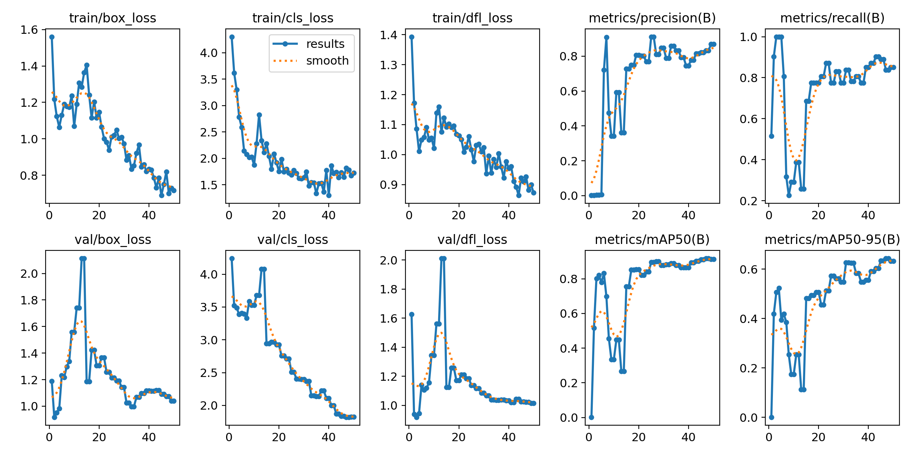

## Guion de prácticas de la asignatura Visión por Computador (VC)

Modesto Castrillón Santana  
Universidad de Las Palmas de Gran Canaria  
Escuela de Ingeniería en Informática  
Grado de Ingeniería Informática  
Curso 2025/2026 

** Dunia Suárez Rodríguez **

- # [Práctica 5]
## Descripción
En la Práctica 5 se realiza el entrenamiento de un modelo propio para la extracción de información biométrica (emociones), aplicando técnicas de Transfer Learning. Este modelo se integra posteriormente en una aplicación en tiempo real (filtro). Además, se incluye un segundo prototipo de filtro creativo de temática libre.

## Requisitos
Para esta práctica haremos uso de Python 3.11, Anaconda y de las librerías:
- opencv: procesamiento de imágenes y cámara
- numpy: operaciones con matrices
- time: para medir tiempo de cómputo de entrenamiento
- sklearn: librería de Machine Learning que proporciona el algoritmo SVM
- joblib: herramienta de serialización optimizada para guardar y cargar modelos entrenados y grandes arrays de datos en disco
- deepface: framework de reconocimiento facial que simplifica el uso de modelos de Deep Learning (como FaceNet) para la detección y extracción de embeddings
- random: generar obstáculos en posiciones aleatorias
- os: verificar existencia de archivos

Además nos conectaremos al entorno 'VC_P5' creado con Anaconda.

## Modo de ejecución
1.  *Crear el entorno (basado en P5):*
    conda create --name VC_P5 python=3.11.5
    conda activate VC_P4
2.  *Instalar librerías principales:*
    pip install opencv-python numpy scikit-learn joblib deepface
3. *Ejecutar el código de "Extracción de características".*
4. *Ejecutar el código de "Entrenamiento".*
5. *Ejecutar el script "prototipo_emociones_animado.py" y "prototipo_juegoVJ" para la visualización de los 2 filtros.*

## Extracción de características(Embeddings)
En esta primera fase, el objetivo es transformar las imágenes "crudas" (píxeles) en una representación matemática compacta que un modelo de Machine Learning pueda procesar. No se realiza entrenamiento aquí, solo procesamiento de datos.
El dataset original que he escogido tiene cerca de 4000 imagenes por clase, así que he limitado el número de imagenes por clase `MAX_IMAGES_PER_CLASS = 600`.

Utilizamos el modelo FaceNet (a través de DeepFace), que requiere una entrada de imágenes de 160x160 píxeles.
* Es una Red Neuronal Convolucional (CNN) desarrollada por investigadores de Google. Su arquitectura está diseñada específicamente para transformar imágenes de rostros, ignorando detalles irrelevantes (iluminación, pose) y centrarse en los rasgos biométricos únicos, condensándolos en un vector de 128 dimensiones.

La función principal es `LoadDataset` que recorre el directorio de imágenes, procesa cada cara con DeepFace para obtener su "huella digital" numérica (embedding) y devuelve los arrays X (características) e Y (etiquetas) necesarios para entrenar el modelo SVM. Para ello realiza lo siguiente en cada imagen:
- Carga la imagen con `cv2.imread` y la redimensiona a las dimensiones requeridas por el modelo(160x160).
- Con la función `DeepFace.represent` se pasa la imagen por la red neuronal pre-entrenada 'Facenet' y la convierte en un vector de 128 números (el embedding). El parámetro `enforce_detection=False` evita que el script se detenga si DeepFace no encuentra una cara clara en una foto específica. Tras esta función se extrae el vector `img_embedding` de 128 números que representa las características faciales únicas de esa imagen.
- Los datos se guardan en 
    * X(Features) -> matriz donde cada fila es el vector de 128 números de una cara
    * Y(Labels) -> vector con el número entero correspondiente a la emoción (ej: 0 para 'angry', 1 para 'happy').

Una vez ejecutada la función que recorre las imágenes, convertimos las listas X e Y a numpy arrays(necesario para Scikit-Learn).

Antes de procesar nada, construimos el modelo FaceNet en memoria. Esto es necesario para obtener dinámicamente las dimensiones de entrada que requiere la red. Pasamos estas dimensiones (dim) a la función de carga para asegurar que todas las imágenes se redimensionen al tamaño exacto. 

Continuamos con la llamada la función `LoadDataset`. Esta devuelve los arrays X (datos) e Y (etiquetas), así como estadísticas sobre el número de muestras procesadas. 

Para finalizar, usamos la librería joblib para serializar y guardar las matrices X e Y en archivos .pkl (embeddings_X.pkl, labels_Y.pkl). Esto permite que el siguiente script (entrenamiento) cargue los datos instantáneamente sin tener que volver a procesar las imágenes.
Se guardan tres archivos en disco:
* `embeddings_X.pkl`: La matriz matemática con todas las caras procesadas.
* `labels_Y.pkl`: Las respuestas correctas (qué emoción es cada vector).
* `emotion_class_names.pkl`: Nos permitirá traducir en el futuro que la etiqueta 0 significa "angry" o la 3 significa "happy".

## Entrenamiento y optimización del clasificador SVM
Una vez convertidas las imágenes a vectores numéricos, utilizamos un algoritmo de aprendizaje supervisado para encontrar patrones que diferencien una emoción de otra.

Primero cargamos los arrays X e Y generados en el paso anterior normalizaciamos sus valores con `MinMaxScaler`. Se normalizan pues los algoritmos basados en distancias como el SVM son muy sensibles a la escala de los datos. Si no normalizamos, una característica con valores numéricos altos dominaría la decisión sobre otras con valores pequeños, degradando el rendimiento.

Continuamos con la configuración del clasificador (SVM con Kernel RBF). 
* Utilizamos una Máquina de Vectores de Soporte (SVC).
    SVC (Support Vector Classification) es un algoritmo de aprendizaje supervisado que busca encontrar el hiperplano óptimo (una frontera de decisión) que separe las diferentes clases de datos con el mayor margen posible. Se usa SVC pues es altamente efectivo trabajando con vectores de alta dimensión (como los embeddings de 128 valores de FaceNet).
* Elegimos el kernel `rbf` (Radial Basis Function). A diferencia de un kernel lineal, el RBF permite trazar fronteras de decisión curvas y complejas, lo cual es fundamental para datos biométricos donde las diferencias entre "feliz" y "neutro" no son linealmente separables.
* Usamos `class_weight='balanced` para que el modelo preste más atención a las clases con menos fotos, evitando que se sesgue hacia la emoción mayoritaria.

`GridSearchCV` es usado para sistematizar el entrenamiento. En lugar de entrenar un único modelo con parámetros aleatorios, GridSearchCV genera múltiples versiones del clasificador SVM combinando diferentes valores de regularización (C) y coeficientes de kernel (Gamma), seleccionando finalmente el modelo que ofrece la mayor precisión estadística. Los parámetros críticos son:
* C (Regularización): Controla la rigidez del margen. Un valor alto intenta clasificar todo correctamente (riesgo de sobreajuste), mientras que uno bajo permite más errores buscando una frontera más suave.
* Gamma: Define el alcance de la influencia de un solo ejemplo de entrenamiento.
A continuación, el método `.fit()` ejecuta el proceso de búsqueda y entrenamiento definido por `GridSearchCV`.

Finalmente, guardamos los dos archivos esenciales para el prototipo:
* `emotion_svm_model.pkl`: El clasificador SVM ya entrenado.
* `emotion_scaler.pkl`: La "regla" de normalización. Es vital guardar el scaler para aplicarle exactamente la misma transformación matemática a las caras que capte la webcam en el futuro.

## Prototipo Filtro 1(con modelo entrenado)
Este script integra el modelo entrenado en una aplicación de visión artificial que captura vídeo, procesa rostros frame a frame y genera una respuesta visual (pantalla de color) basada en la emoción detectada.

Comenzamos con la carga de los tres archivos esenciales generados anteriormente:
* `emotion_svm_model.pkl`
* `emotion_scaler.pkl`
* `emotion_class_names.pkl`

Continuamos con la captura y detección facial (MTCNN). Mediante un bucle analizamos cada fotograma y utilizamos DeepFace.extract_faces con el backend MTCNN (Multi-task Cascaded Convolutional Networks). Usamos MTCNN, en vez de otro detector, pues es mucho más robusto ante variaciones de luz y pose, lo que mejora la experiencia de usuario en tiempo real, aunque requiere más cómputo. Aplicamos un filtro de confianza (> 0.75) para descartar falsos positivos.

Para cada rostro validado:
* Recortamos la región de interés de la cara y la convertimos a RGB y con `DeepFace.represent` (modelo FaceNet) convertimos la cara en el vector de 128 características. 
* Normalizamos los valores del vector con `scaler.transform`. 
* Utilizamos `svm_model.predict_proba` que nos da la clase ganadora y el porcentaje de certeza.
* Si la certeza del modelo supera el 55%(`CONF_THRESHOLD`), se activa la reacción.
* Implementamos una función `apply_tint` que utiliza `cv2.addWeighted` para fusionar la imagen original con una capa de color semitransparente.

Cada emoción tiene asignado un código de color (ej: Amarillo para "happy", Verde para "disgusted"), proporcionando feedback visual instantáneo y aumentado sobre la realidad.

## Prototipo Filtro 2(libre)
Este prototipo es un videojuego de estilo endless runner donde el jugador controla un personaje alienígena utilizando exclusivamente el movimiento vertical de su cabeza en el mundo real.
Instrucciones:
* Control: Mueve tu cabeza físicamente hacia arriba o abajo frente a la cámara para esquivar los muros.
* Objetivo: Sobrevivir el mayor tiempo posible. La velocidad aumenta progresivamente. 
* Teclas: 
    ESPACIO: Reiniciar el juego tras un "Game Over". 
    ESC: Salir.

A diferencia del filtro de emociones, aquí la prioridad es la baja latencia (velocidad de respuesta). Por ello, se usa:
* Sensor Biométrico (Input): Utilizamos la implementación de Haar Cascades de OpenCV, basada en el algoritmo clásico de Viola-Jones. Aunque es menos robusto ante rotaciones que las redes neuronales modernas (como MTCNN), es extremadamente rápido y computacionalmente ligero. Esto garantiza que el juego responda al movimiento de manera más ligera.
* Renderizado y Motor Gráfico: La imagen de la webcam no se muestra; se utiliza únicamente como sensor de entrada. Cada fotograma se sobrescribe completamente con un fondo estático (background.png). Sobre este fondo se superponen los sprites (jugador y obstáculos) respetando sus transparencias.

Funciones y Parámetros Clave
1. Detección Facial: `detectMultiScale` es la función encargada de encontrar la cara en cada frame para mover al jugador. Parámetros:
* gray: La imagen de entrada en escala de grises (optimiza el rendimiento).
* scaleFactor=1.1: Especifica cuánto se reduce el tamaño de la imagen en cada escala de la pirámide de imágenes. Un valor de 1.1 significa que se reduce un 10% cada vez, ofreciendo un buen equilibrio entre precisión y velocidad.
* minNeighbors=4: Especifica cuántos "vecinos" (detecciones superpuestas) debe tener cada rectángulo candidato para conservarlo. 
* minSize=(30, 30): El tamaño mínimo del objeto. 
Se ignoran las caras más pequeñas que esto.

2. Carga segura de recursos: la función `load_asset` evita errores de ejecución pues:
* Verifica si el archivo existe antes de cargarlo.
* Utiliza el flag cv2.IMREAD_UNCHANGED. Esto es vital para cargar imágenes PNG manteniendo sus 4 canales (BGRA), ya que por defecto OpenCV elimina el canal Alfa.

3. Superposición Gráfica: la función `overlay_png` realiza Alpha Blending (mezcla de transparencias). OpenCV no soporta canales alfa (transparencia) de forma nativa con una simple suma, por lo que calculamos la mezcla pixel a pixel. 
* Lógica de recorte: Utilizamos background.shape[:2] y overlay.shape[:2] para obtener las dimensiones (Alto, Ancho) y calcular si el objeto se sale de la pantalla, recortándolo matemáticamente para evitar errores de ejecución (IndexError).
Fórmula de mezcla: 
$$
\text{Pixel}_{final} = (\text{Pixel}_{objeto} \cdot \alpha) + (\text{Pixel}_{fondo} \cdot (1 - \alpha))
$$

4. Interfaz de Usuario (UI): `cv2.putText` es utilizada para dibujar el marcador y los mensajes de estado.

5. Lógica de Generación Procedural
El juego es infinito gracias a la generación dinámica de obstáculos:obstacles[-1][0] < width - 250: Este condicional comprueba la posición X del último obstáculo generado. El valor 250 define la distancia mínima horizontal entre muros, asegurando que el juego sea jugable y dando tiempo de reacción al usuario.

La IA Gemini se utilizó como recurso de apoyo para aclarar dudas, explorar funcionalidades de la librerías que no conocía y obtener orientación.

<!-- - [Práctica 6](P6/README.md) -->
<!-- - [Práctica 7](P7/README.md) -->
<!-- - [Trabajo](Trabajo/README.md) -->
***
Obra bajo licencia de Creative Commons Reconocimiento - No Comercial 4.0 Internacional
